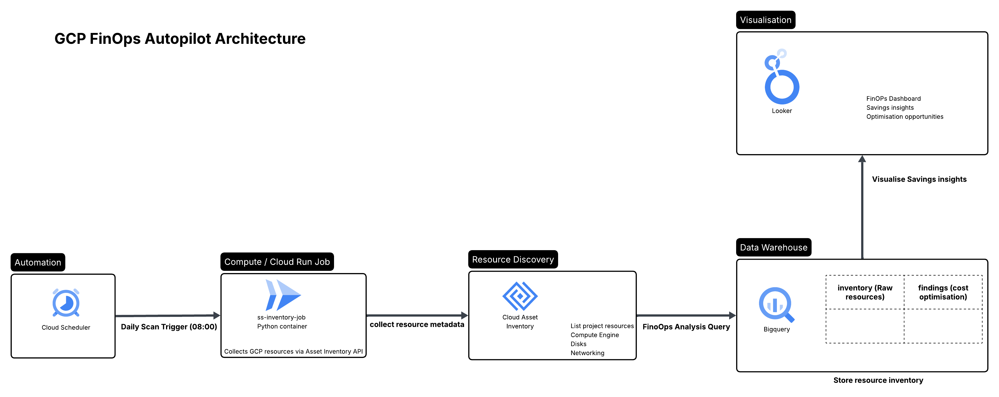
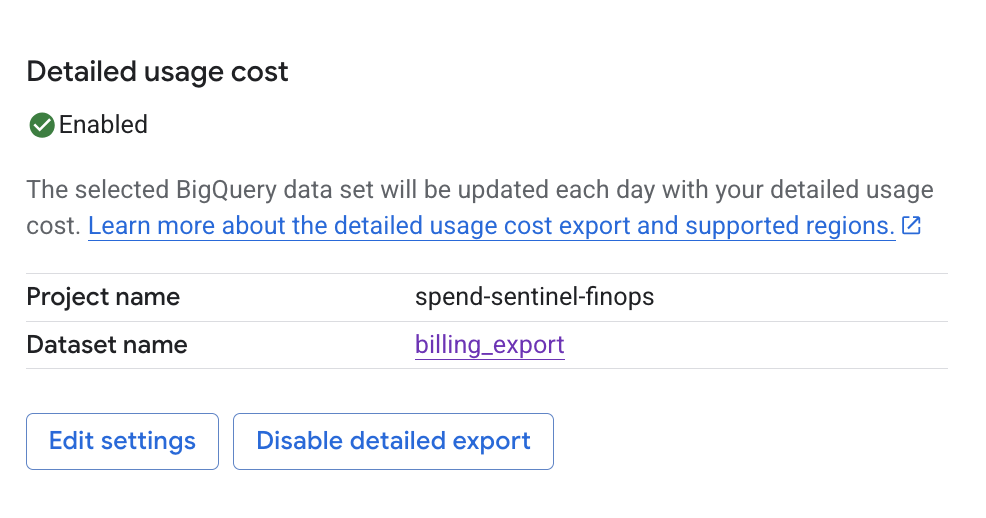
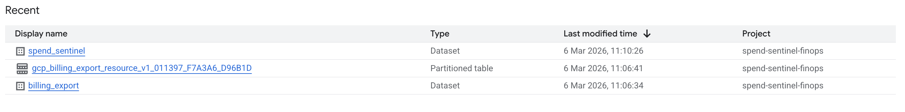
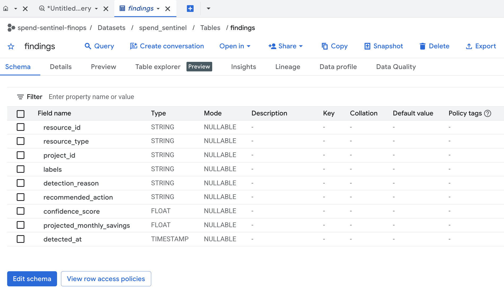
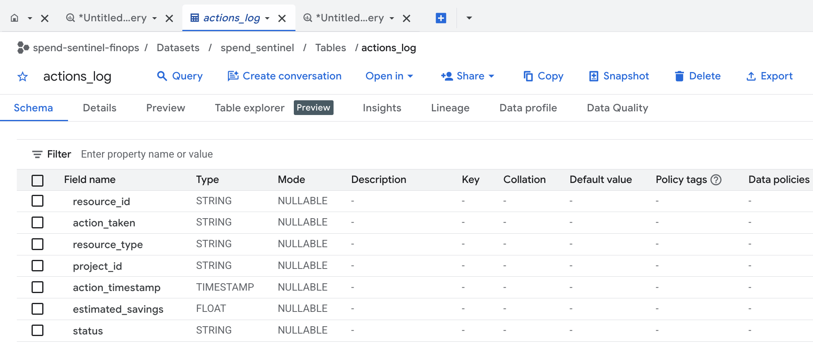
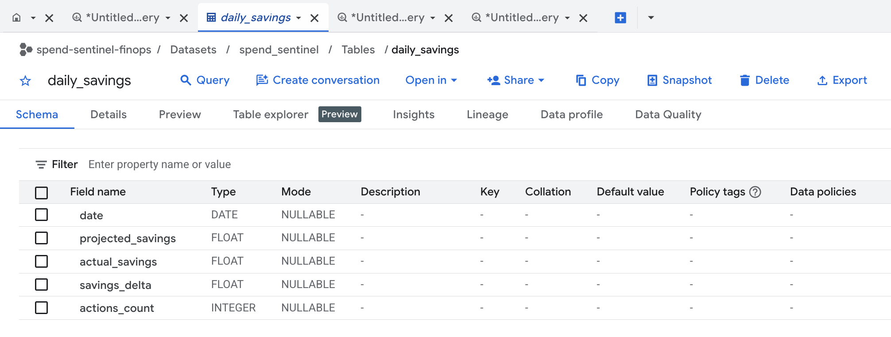
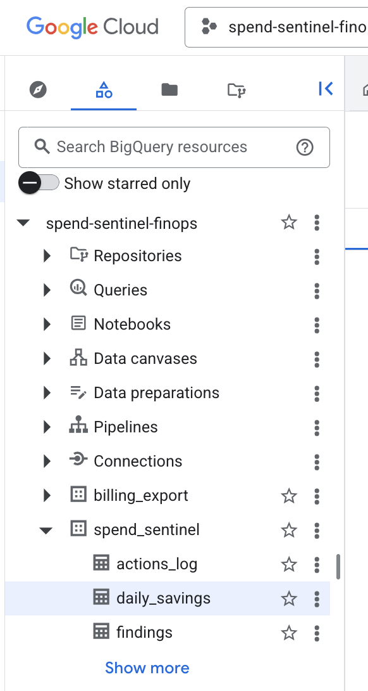
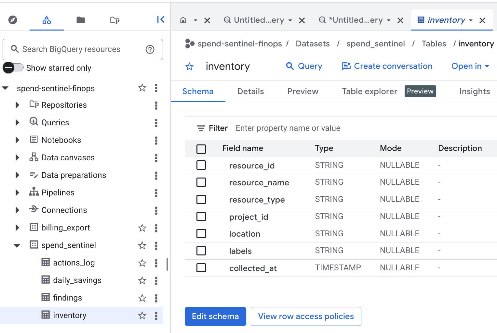

# SpendSentinel – GCP FinOps Autopilot

## Architecture

## Overview

SpendSentinel is a serverless FinOps automation platform built on Google Cloud that continuously discovers infrastructure resources, detects cost optimisation opportunities, and visualises potential savings through a dashboard.

The project demonstrates how cloud architects can build automated cost visibility pipelines using native GCP services.

---

## The Problem

Cloud environments grow quickly. As infrastructure scales, it becomes difficult for engineering teams to identify:

- Idle resources
- Oversized compute instances
- Cost optimisation opportunities
- Infrastructure waste

Without automated visibility, cloud spend increases silently.

SpendSentinel solves this by automatically scanning cloud infrastructure and highlighting potential savings.

---

### Architecture Flow

1. **Cloud Scheduler**
   - Triggers a daily infrastructure scan.

2. **Cloud Run Job**
   - Runs a Python container responsible for collecting resource metadata.

3. **Cloud Asset Inventory API**
   - Discovers infrastructure resources across the project.

4. **BigQuery**
   - Stores resource inventory and FinOps optimisation findings.

5. **Looker Studio**
   - Visualises cost optimisation insights through dashboards.

---

## Project Walkthrough

Below are key stages showing the platform being built and producing FinOps insights.

---

### Billing Export Enabled

Cloud billing export is enabled so cost data can be analysed in BigQuery.

---

### BigQuery Dataset Created

The SpendSentinel dataset stores infrastructure inventory and cost analysis data.

---

### Findings Table Created

This table stores detected cost optimisation opportunities.

---

### Actions Log Table Created

Tracks optimisation actions taken across infrastructure.

---

### Daily Savings Table

Stores aggregated potential savings per day.

---

### BigQuery Tables Overview

All FinOps data tables created successfully.

---

### Inventory Table Populated

The Cloud Run job successfully discovers infrastructure resources and writes them to BigQuery.

---

## Services Used

- Google Cloud Run
- Cloud Scheduler
- Cloud Asset Inventory API
- BigQuery
- Looker Studio
- Compute Engine (test infrastructure)

---

## Data Pipeline Flow

Cloud Scheduler triggers a daily scan:

Cloud Scheduler  
↓  
Cloud Run Job  
↓  
Cloud Asset Inventory API  
↓  
BigQuery (inventory table)  
↓  
FinOps analysis query  
↓  
BigQuery (findings table)  
↓  
Looker Studio Dashboard  

---

## BigQuery Tables

### inventory

Stores discovered infrastructure resources.

Columns include:

- resource_id
- resource_name
- resource_type
- project_id
- location
- labels
- collected_at

---

### findings

Stores cost optimisation insights generated by FinOps queries.

Columns include:

- resource_id
- resource_name
- finding_type
- recommendation
- estimated_monthly_savings
- detected_at

---

## Example Optimisation Finding

The system detected a compute instance that could potentially be right-sized.

| Resource | Finding | Estimated Monthly Savings |
|--------|--------|--------|
| ss-test-vm | Rightsize Candidate | $27 |

Estimated yearly savings:

$324 per year

---

## Dashboard

The Looker Studio dashboard displays:

- Estimated monthly savings
- Number of optimisation opportunities
- Flagged infrastructure resources

---

## Project Structure

spend-sentinel/
│
├── inventory_service/
│   ├── inventory.py
│   ├── requirements.txt
│   └── Dockerfile
│
├── sql/
│   ├── create_inventory_table.sql
│   ├── create_findings_table.sql
│   └── cost_analysis_query.sql
│
└── docs/
    └── images/
        ├── architecture-diagram.png
        └── finops-dashboard.png

---

## Key Outcomes

This project demonstrates how to:

- Build automated infrastructure discovery pipelines
- Use serverless compute for scheduled cloud analysis
- Store infrastructure telemetry in BigQuery
- Detect cost optimisation opportunities
- Visualise FinOps insights with Looker Studio

---

## Future Improvements

Possible enhancements:

- Organisation-wide resource scanning
- Integration with Cloud Billing export data
- Automated Slack cost alerts
- ML-based anomaly detection for unusual cloud spend
